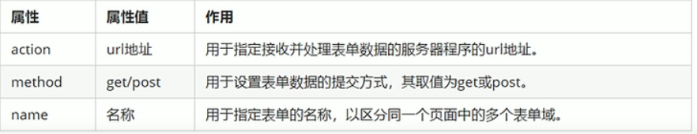

# HTML学习

## 2022.3.25（3h）

Web标准的构成：结构，表现，行为

#### 基础标签

```html


<!DOCTYPE> 文档类型声明
lang 定义当前文档显示的语言
<div><meta charset=UTF-8> 字符集标签<div>
<h1-h6> 1到6级标签
<p> 段落标签
<br /> 换行标签（单标签）
<strong>/<b> 加粗
<em>/<i> 倾斜
<del>/<s> 删除线
<ins>/<u> 下划线
<div>:一行只能放一个的大盒子
<span>:一行可以放多个的小盒子
* (单标签)

```

#### 图像标签


#### 超链接标签

```html
<a> 
分类：
外部链接：<a href="http://www.qq.com" target="_self">腾讯</a>
内部链接：<a href=""index.html></a>
空链接：<a href="#">首页</a>
下载链接：<a href="img.zip">下载文件</a>   
网页元素的链接：<a href="http://www.baidu.com"></a>
锚点链接：快速定位到页面中的某个位置 <a href="#id"></a>
```


```html
<!--注释--> 快捷键：CTRL+/
```

#### 特殊字符标签


#### 表格标签


```
<th>标签表示HTML表格的表头部分
<thead>标签表示表格的标题部分
<tbody>标签表示表格的主体区域
合并单元格方式：
跨行合并：rowspan="合并单元格的个数"
跨列合并：colspan="合并单元格的个数"
```


#### 列表标签：

1.无序列表


2.有序列表


3.自定义列表

## 

## 2022.3.26(3h)

#### 表单

表单的组成：表单域 表单控件

表单域form：



#### 表单控件input

属性type


```
<label>标签用于绑定一个表单元素，当点击<label>标签内的文本时，会自动将光标转到或者选择对应的表单元素上
```


```
<select>下拉选择框
<select>
	<option></option>
<select>
selected="selected"默认选择 
<textarea clos="每行中的字符数" rows="xia'b">文本域
```

# CSS学习

#### CSS选择器及字体、文本属性

```
CSS规则主要由两个部分构成：选择器以及一条或多条声明
例：<style>
	p {
		color:red; 
		font-size：20px
	  }
</style> (注：写在head标签中)
选择器分为基础选择器和复合选择器
基础选择器包括：标签选择器、类选择器、id选择器和通配符选择器
标签选择器：以HTML标签名称作为选择器
类选择器：适用于差异化选择不同的标签
例：<style>
	.red{
		color: red
	}
	</style>
	<div class="red"></div> (注：不要使用纯数字、中文，可以有多个类名 用空格隔开)
id选择器：适用于有id属性的标签
#id{} (注：id只能调用一次，不可重复)
通配符选择器：选择所有标签标签
*{}
CSS字体属性：
字体系列：font-family: '',''(字体之间用英文逗号隔开，就前原则)
字体大小：font-size:(标题标签比较特殊，不能用body，要单独指定大小)
字体粗细：font-weight:(normal(默认):400 blod(粗体):700)
文字样式：font-style:normal(正常) italic(倾斜)
字体复合属性：font: font-style font-weight font-size/line-heighy font-family (注：顺序不可改变,不需要的属性可以省略，但是必须保留size和family属性)
CSS文本属性：
文本颜色：color
对齐文本：text-align(left right center)
文本装饰：text-decoration(可用来去除a标签自带的下划线)
```


#### CSS样式表

```
文本缩进：text-indent (第一行首行缩进，em：相对单位，相对于当前文字大小)
行间距：line-height
CSS三种样式表
内部样式表：写到html内部，放在style标签内
行内样式表：在元素标签内部写style属性 style=""
外部样式表：样式单独写到CSS文件中再引入html文件
<link rel="stylesheet" href="css文件路径">
```

## 2022.3.27(4h)

#### Emmet语法

```
Emmet语法
1.快速生成HTML结构语法
！+TAB快速生成结构
标签*个数+TAB
如果有父子级关系的标签，可以用> 比如ul>li
如果有兄弟级关系的表用，可以用+ 比如div+p
如果生成带有类名或者id名的 比如p.demo 或者p#red
如果生成的div类名是有顺序的，可以用自增符号$ 比如.demo$*5
可以在{里加上默认显示的文字} 比如div{。。。}
```

#### 复合选择器

```
1.后代选择器：ol li{} (元素1 元素2)
2.子选择器：div > a (元素1>元素2 注：只能选择最近一级子元素)
3.并集选择器：并集选择器可以选择多组标签，同时为他们定义相同的样式。(元素1，元素2，推荐竖着写)
4.伪类选择器：用于向某些选择器添加特殊效果，或者选择第n个元素
4.1 链接伪类选择器：
a:link  选择所有未被访问的链接
a:visited  选择所有已被访问的链接
a:hover  选择鼠标指针位于其上的链接
a:active 选择活动链接(鼠标按下未弹起)
(注：按照link visited hover active LVHA的顺序声明)
4.2 focus伪类选择器：用于选取获得焦点的表单元素(适用于input标签)
```

#### CSS显示模式

```
1.块元素：<h1>~<h6> <p> <div> <ul> <li>等
特点：1.独占一行 2.高度 宽度 外边距 内边距都可以控制 3.宽度默认是容器的100% 4.是一个容器及盒子，里面可以放行内或者块元素
(注：文字类的元素内不能使用块级元素如<p> <h1>)
2.行内元素:<a> <strong> <b> <em> <i> <span>等
特点:
1.相邻行内元素在一行上，一行可以显示多个 
2.高 宽直接设置是无效的 
3.默认宽度就是它本身内容的宽度 
4.行内元素只能容纳文本或其他行内元素
(注：链接里面不能再放链接，特殊情况<a>里面可以放块级元素，但是给<a>转换一下块级模式最安全)
3.行内块元素： <input/> <td> 同时具有块元素和行内元素的特点
特点：
1.和相邻行内元素在一行上，但是他们之间会有空白缝隙。一行可以显示多个 
2.默认宽度就是它本身内容的宽度 
3.高度 行高 外边距和内边距可以控制
4.元素显示模式转换：display：block(行->块) display:inline(块->行) display:inline-block(行 块->行内块)
```

#### CSS背景

```
背景颜色：background-color: (默认transparent透明)
背景图片：background-image:none |url=()
背景平铺：background-repeat:no-repeat|repeat-x|repeat-y
背景图片位置：background-position:center right (10px|top|center|botton)
(注：如果两个都是方位名词则前后顺序无关，如果省略一个方位名词则省略的默认为居中)
背景图像固定：background-attachment:scroll|fixed
背景属性复合写法：background (color image repeat attachment position)
背景颜色半透明：rgba(0,0,0,0.3) (alpha透明度：0-1)
```

#### CSS三大特性

```
层叠性：就近原则
继承性：子标签会继承父标签的某些样式如文本颜色和字号
行高的继承性：
body{
	font:12px/1.5
}
(行高可以跟单位也可以不跟)
优先级：同一个元素指定多个选择器时根据选择器权重执行
注意点：a标签默认有一个样式权重为（0，0，0，1），继承的权重为0
权重叠加：如果时复合选择器，则权重需要叠加(位与位相加且不进位)
```


## 2022.3.28(4.5h)

#### 盒子模型

```
盒子模型封装周围的HTML元素，它包括：边框border、外边距margin、内边距padding和实际内容content
边框border:border-width border-style border-color
注：分割写法 border-top:10px solid red
border-collapse:collapse(合并相邻边框)
内边距padding：(注：如果盒子本身没有指定width/height属性，则padding不会撑开盒子大小)
```


```
外边距margin：块级盒子水平居中 1.设置宽度 2.左右外边距设置为auto
行内元素水平居中：给父元素添加text-align：center
嵌套块元素塌陷：对于两个嵌套关系的块元素，父元素有上外边距同时子元素也有上外边距，此时父元素会塌陷较大的外边距值 解决方案：1.可以为父元素定义上边框 border：1px solid transparent 2.可以为父元素定义上内边距 padding: 1px 3.可以为父元素添加overflow：hidden
清除内外边距：*{
	padding：0;
	margin:0;
}
圆角边框border-radius:圆的半径
```

#### PS切图

```
图层切图：1.右击图层->快速导出为PNG 2.shift选中 ctrl+E合并 
切片切图：用切片工具手动切出再导出
PS插件切图：Cu
```


```
盒子阴影：box-shadow:10px 10px  -4px rgba(0,0,0,.3)
(注：不占用空间)
文字阴影：类盒子阴影 (h-shadow) (v-shadow) (blur) (color)
```


传统网页布局的三种方式：

1.标准流（普通流/文档流）

2.浮动

3.定位

浮动

```
网页布局第一准则：多个块级元素纵向排列找标准流，多个块级元素横向排列找浮动
float属性用于创建浮动框，将其移动到一边，直到左边缘或右边缘触及包含块或另一个浮动框的边缘
语法：
选择器{float：属性值；}(属性值：none left right)
浮动特性：1.浮动元素会脱离标准流 2.浮动的元素会一行内显示并且元素顶部对齐 3.浮动的元素会具有行内块元素的特性
重点！
1.脱离标准流的控制移动到指定位置且浮动的盒子不再保留原先的位置
2.如果多个盒子都设置了浮动，则它们会按照属性值一行内显示并且顶端对齐排列
3.任何元素都可以浮动。不管原先是什么模式的元素，添加浮动之后具有行内块元素相似的特性
为了约束浮动元素的位置，我们网页布局一般采取的策略是：
先用标准流的父元素排列上下位置，之后内部子元素采取浮动排列左右位置。
```

#### 清除浮动

```
清除浮动的本质是清除浮动元素造成的影响，如果f盒子本身有高度，则不需要清除浮动 
选择器{clear：属性值}(left right both)
清除浮动方法：
1.额外标签法 在浮动元素末尾添加一个空的标签 例如<div style="clear:both"></div>
优点：通俗易懂，书写方便 缺点：添加许多无意义的标签，结构化较差 (注：新添加的标签必须为块级标签)
2。父级添加overflow属性 父元素{  overflow：hidden/auto/srcoll }
优点：代码简洁 缺点：无法显示溢出的部分
3.父级添加after伪元素 父元素：after {
	content：""；
	display：block；
	clear：both	
}
	父元素{
		*zoom:1;
	}
	优点：没有增加标签，结构更简单 缺点：照顾低版本浏览器
4.父级添加双伪元素 父元素：before，父元素：after{
	content：""；
	display：table；
	clear：both	
}
	父元素{
		*zoom:1;
	}
	优缺点：同法3
```

##### 2022.3.29(4.5h)

```
实际开发中，一般不直接a链接而是用li+a
```

##### 2022.3.30(3h)

学成在线案例

#### 定位

##### 2022.3.31(5h)

```
定位可以让盒子自由的在某个盒子内移动位置或者固定在屏幕中的某个位置，并且可以压住其他盒子
定位=定位模式+边偏移
定位模式position：
```


```
边偏移：
```


```
静态定位：按照标准流特性摆放位置，没有边偏移
相对定位relative：
1.相对于原来的位置移动(相对于原位置的距离) 
2.原来的位置继续占有
绝对定位absolute：相对于祖先元素移动
1.如果没有祖先元素或者祖先元素没有定位，则以浏览器为准(Document文档)
2.如果祖先元素有定位，则以最近一级有定位的祖先元素为准
3.绝对定位不在占有原先定位(脱标)
子绝父相：子级选择绝对定位，父级需要为相对定位
固定定位fixed:固定定位是元素固定于浏览器可视区的位置
1.以浏览器的可视窗口为参照点移动元素
2.与父元素没有任何关系
3.不随滚动条滚动
4.不占有原先位置
```

```
固定定位小技巧：与版心保持固定距离
1.让固定定位的盒子left：50% 走到浏览器可视区的一半位置
2.让固定定位的盒子margin-left：版心宽度的一半距离。多走版心宽度的一半位置
粘性定位sticky：相对定位和固定定位的混合 
选择器 {position：sticky；top：10px}
1.以浏览器的可视窗口为参照点
2.保留原位置
3.必须添加至少一个位置
```

```
定位叠放次序z-index：在使用定位布局时，可能会出现盒子重叠的情况。此时，可以使用z-index来控制盒子的前后次序(z轴)
选择器{z-index：1；}
绝对定位的盒子居中算法：
1.left：50% 父容器的一半
2.margin-left：-(width/2) 自身宽度的一办
定位特殊特性：
1.行内元素定位之后可以直接加宽高
2.块级元素定位之后如果没有设置宽高，则默认为内容的大小
3.脱标的元素不会发生外边距塌陷
4.绝对定位会完全压住盒子，浮动元素只会压住盒子，不会压住内容
```

#### 元素的显示与隐藏

```
1.display：
display：none 隐藏元素 不再占有原来的位置
display：block 显示元素
2.visibility：
visiblity：visible；元素可视
visibi：hidden；元素隐藏 继续占有原来的位置
如果隐藏元素想要原来位置，就用visibility：hidden 如果不想要，就用display：none
3.overflow：
```

# CSS高级技巧

#### 精灵图

```
为了有效地减少服务器接收和发送请求的次数，提高页面的加载速度，出现了CSS精灵技术
使用精灵图核心：
1.精灵技术主要针对背景图
2.移动背景图片位置，此时可以使用background-position
3.移动的距离就是这个目标图片的x和y坐标(往上，左都是负值)
```

#### 字体图标

```
下载网站：icomoon字库 http://icomoon.io     
阿里iconfont字库 http://www.iconfont.cn/
```

#### 字体声明

```
icomoon:
@font-face {
  font-family: 'icomoon';
  src:  url('fonts/icomoon.eot?p4ssmb');
  src:  url('fonts/icomoon.eot?p4ssmb#iefix') format('embedded-opentype'),
    url('fonts/icomoon.ttf?p4ssmb') format('truetype'),
    url('fonts/icomoon.woff?p4ssmb') format('woff'),
    url('fonts/icomoon.svg?p4ssmb#icomoon') format('svg');
  font-weight: normal;
  font-style: normal;
  font-display: block;
```

```
iconfont:
https://www.iconfont.cn/help/detail?spm=a313x.7781069.1998910419.d8d11a391&helptype=code
```

CSS三角

```
选择器{
	width:0;
	height:0;
	border:10px solid transparent;
	border-top-color:#fff;
}
```

CSS用户界面样式

```
鼠标样式 cursor:
```


```
轮廓线：
input{
	outline:none;
}
防拖拽文本域:
textarea{
	resize:none;
}
vertical-align:经常用于设置图片或者表单和文字垂直对齐(只针对行内元素或者行内块元素有效)
```


```
图片底侧默认留白：
1.vertical-align:middle|top|bottom
2.将图片转换为块级元素
单行文本溢出省略号显示：
1.强制一行内显示文本 white-space:nowrap;
2.超出的部分隐藏 overflow:hidden;
3.文字用省略号替代超出的部分 text-overflow:ellipsis;
多行文本溢出显示省略号：
1.超出的部分隐藏 overflow:hidden;
2.文字用省略号替代超出的部分 text-overflow:ellipsis;
3.弹性伸缩盒子模型显示 display:-webkit-box;
4.限制在一个块元素显示的文本行数 -webkit-line-clamp:2;
5.设置或检索伸缩盒子对象的子元素排列方式 -webkit-box-orient:vertical;
```

#### 常见布局技巧

```
1.margin-left：-1px； 边框合并且不叠加
2.消除1的影响：如果没有定位，则加相对定位即可。如果都有定位，则加z-index
3.文字围绕浮动元素技巧：在大盒子里写内容，再给图片添加浮动即可环绕
```

##### 2022.4.1(9h)

# HTML5的新特性

#### HTML5新增的语义化标签


#### HTML5新增的多媒体标签

##### 视频video


##### 音频audio


#### HTML5新增的input类型


#### HTML5新增的表单属性

#  CSS3新特性

#### CSS3新增选择器

##### 属性选择器


##### 结构伪类选择器


```
n可以是数字 公式 关键词字（even 偶数 odd 奇数）
```


##### 伪元素选择器


```
注意：
1.before和after创建一个行内元素
2.新创建的这个元素在文档树中是找不到的
3.语法：element：：before{}
4.before和after必须有content属性
5.before在父元素前面创建元素，after在父元素内容后面插入元素
6.伪元素选择器和标签选择器一样，权重为0001
```

##### CSS3盒子模型

```
box-sizing：content-box(默认)   border-box(padding和border不会撑大盒子，前提是padding和border不会超过width宽度)
```

##### CSS3滤镜filter

```
filter：函数() 例如：filter：blur(5px)； blur模糊处理 数值越大越模糊 
```

##### CSS3 calc函数

```
width：calc(100%-80%)；
```

##### CSS3过渡


```
favicon图标制作：https://www.bitbug.net/
```

#### TDK三大标签SEO优化

```
SEO：搜索引擎优化，对网站进行深度的优化，从而提升网站在搜索引擎上的排名
三大标签：
1.title网站标题：网站名-网站介绍
2.description网站说明 <meta name="description" content="京东JD.COM-专业的综合网上购物商城，为您提供正品低价的购物选择、优质便捷的服务体验。商品来自全球数十万品牌商家，囊括家电、手机、电脑、服装、居家、母婴、美妆、个护、食品、生鲜等丰富品类，满足各种购物需求。">
3.keywords关键字 <meta name="Keywords" content="网上购物,网上商城,家电,手机,电脑,服装,居家,母婴,美妆,个护,食品,生鲜,京东">
```

#### 常用命名


#### LOGO SEO 优化

```
1.放一个h1标签，目的是为了提权
2.h1里放一个链接返回首页，把logo作为背景图片给链接
3.为了搜索引擎收录，链接里要放文字(网站名称)
(1).text-indent移到盒子外面(text-indent：-9999px)，然后overflow：hidden
(2).font-size：0；
4.给链接一个title属性，这样鼠标放到logo上时就可以看到提示
```

##### 2022.4.2()

#### CSS3 2D转换

```
transform:可以实现盒子的位移，旋转 ，缩放
移动translate(x,y):
1.不会影响其他元素的位置
2.百分比单位是相对于自身元素的
3.对行内标签没有效果
4.居中写法：top:50% left:50% transform:translate(-50%,-50%)
旋转rotate:在二维平面内顺时针或逆时针旋转
transform: rotate(20deg);
设置旋转中心点：transform-origin:x y;
注：默认是元素的中心点(50% 50%) 还可以设置像素或者方位名词(top right..)
scale缩放:
transform:scale(x,y);
注：可以设置中心点，同旋转。不会影响其他盒子!
综合写法：transform:translate() rotate() scale()...
1.顺序会影响效果 
2.位移要在最前面
```

#### CSS3 动画

```
1.定义动画 2.调用动画
@keyframes 动画名称{
	0%{
		width:100px;
	}
	100%{
		width:200px;
	}
}
动画序列：
1.0%是动画的开始，100%是动画的完成
2.在@keyframes中规定某项CSS样式，就能创建由当前样式逐渐变为新样式的动画效果
3.动画是使元素从一种样式逐渐变为另一种的效果，可以改变任意多的样式任意多次
4.以百分比来规定变化发生的事件，或者用关键词"from"和"to"，等同于0%和100%
元素调用动画：
	div{
		width:200px;
		height:200px;
		background-color:aqua;
		margin:100px auto;
		/*调用动画*/
		animation-name:动画名称;
		/*持续时间*/
		animation-duration:持续时间;
	}
CSS动画简写：animation：动画名称 持续时间 运动曲线 何时开始 播放次数 是否反方向 动画起始或结束的状态
```


#### CSS3 3D转换

```
translateZ(100px)/translate3D(0,0,100px) (3D不能省略值)
```


```
透视perspective:
3D效果必须要加透视！！！
透视写在被观察元素的父盒子上：
d：视距，人眼到屏幕的距离
z：z轴，物体距离屏幕的距离，z轴越大看到的物体就越大
```

#### CSS3 3D旋转

```
左手准则：左手拇指指向轴，四指弯曲方向为旋转方向
```


#### CSS 3D呈现

```
transform-style:
```


#### 浏览器私有前缀


